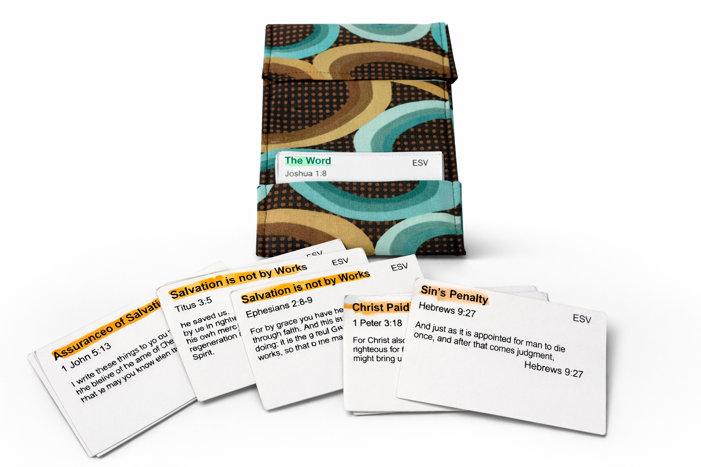

# VersePacks.com

VersePacks is a simple tool for generating clean, printable bible verse flash cards.  
Paste your text, format it, and create shareable cards ready for printing or digital use.

## ✨ Features

- Clean, minimal card layout
- Customizable text formatting
- Automatic spacing and alignment
- Print-friendly output
- Fast, lightweight, and easy to use

## 🚀 Use Cases

- Scripture memory cards
- Event handouts
- Small group materials
- Personal study tools

## 🛠 Tech Stack

- Vue.js
- Bootstrap CSS

## 🖨 Printing

The generated cards are optimized for clean printing. Use your browser’s print dialog and consider:

- Layout: Portrait

- Margins: Default or None

- Scale: 100%

## 📌 Future Improvements

- [ ] Support for double sided printing
- [ ] More translation support (NLT, KJV, etc)
- [ ] Support for custom text and formatting just bible verses
- [ ] Font size and color adjustments

